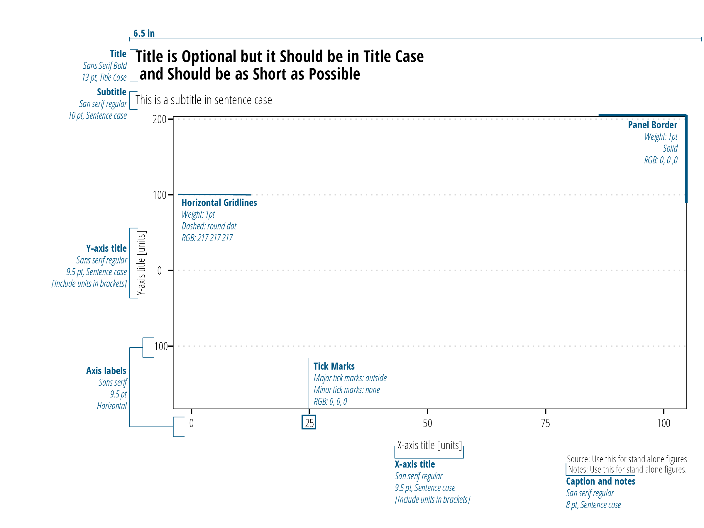

```{r setup, include=FALSE}
## load libraries
library(kableExtra)
library(tibble)
library(dplyr)
library(twriTemplates)
library(ggplot2)
library(patchwork)
library(scales)
library(gapminder)
library(ggrepel)
library(cowplot)
library(ggtext)
library(lubridate)
library(likert)
library(scico)
library(dataRetrieval)

## this sets our default code chunk options
knitr::opts_chunk$set(dev = "ragg_png",
                      echo = FALSE,
                      fig.align = "center",
                      fig.cap = TRUE,
                      fig.retina = 2,
                      fig.width = 600/120,
                      fig.height = 300/120,
                      dpi = 120)
```


# Executive Summary {-}

Use this data visualization style guide to create a uniform look and feel to all of TWRI's charts and graphs. The purpose of this guide is to eliminate the burden of design and color decisions when creating charts and establish some minimum expectations of graphic elements. Consider the following information as general guidance only. 

# Chart Typography

The TWRI and AgriLife brand guides do not specify a font for data visualization usage. We recommend a Sans Serif font for graphs and charts. Good choices include *Arial Nova Cond* (Windows), *Helvetica Neue Condensed* (MacOS), *Open Sans Condensed* (Open Source).

```{r typotable}
typography_table <- tibble::tibble(
  "Chart Parts" = c("Title", "Subtitle", "X and Y axis title", "X and Y axis label", "Legend label", "Direct labels", "Data point labels", "Source and notes"),
  "Typefaces" = c("Arial Bold, Helvetica Bold, Open Sans Condensed Bold", rep("Arial, Helvetica, Open Sans Condensed",4), "Arial Bold, Helvetica Bold, Open Sans Condensed Bold", rep("Arial, Helvetica, Open Sans Condensed",2)),
  "Print Size" = c(13, 10, 9.5, 9.5, 10, 9.5, 9.5, 8),
  "Presentation Size" = c(18, 14, 12, 12, 12, 12, 12, 11),
  "Case" = c("Title Case", rep("Sentence case",7)),
  "Notes" = c("Optional; conveys main point of the chart.",
              "Optional; qualifies or clarifies the title.",
              "Include units or multiplies in brackets [million cfu]",
              "Horzontal preferred, avoid units or multipliers.",
              "Horizontal preferred, avoid redunat labels",
              "Used in line or column charts with three or fewer series.",
              "Always horizontal. No units. Direct labels are preferable to data legends.",
              "Optional.")
  )
knitr::kable(typography_table, booktabs = TRUE, escape = F,
             col.names = linebreak(c("Chart Parts",
                                     "Typefaces",
                                     "Print Size",
                                     "Presentation Size",
                                     "Case",
                                     "Notes")),
             align = "llrrll") %>%
    kable_styling(bootstrap_options = c("striped", "hover", "condensed", "responsive"))
  # column_spec(2, width = "1in") %>%
  # column_spec(6, width = "1in")
```


# Chart Parts

All figures must include axis labels. Axis titles (including units) must be included whenever continuous data is used. We recommend use of axis labels for discrete data, but they can be removed if the measurement variable if obvious and the space is needed (countries is an example of an axis label that isn't always needed). Panel borders are included on all four sides of the plot. Horizontal gridlines are included for technical report figures. Do not use vertical girdlines or axis ticks on minor breaks. However, the use of minor tick marks on log-scaled axis is encouraged.

```{r blankprintfig, out.width="100%", fig.cap="Chart parts and specifications for printed visualizations"}

```


```{r blankpresfig, out.width="100%", fig.cap="Chart parts and specifications for web or PowerPoint visualizations"}
knitr::include_graphics("resources/figures/blank_viz_pp_guide-01.png")
```


Tips:

 - Titles, subtitles, in-chart source and notes are reserved for stand-alone figures only. Use figure captions to title and explain figures in technical reports.
 
 - Legends can stretch horizontally along the bottom or stretch vertically on the right.
 
 - TWRI technical report body is typically 6.5" wide. Export figures at 6.5" wide to take advantage of the full width in the document. Where available, export figures at high resolution (200-300 dpi).
 
 - Powerpoint slides are either 10" wide x 7.5" tall (4:3 aspect slides) or  13.33" wide x 7.5" tall (16:9 aspect slides). Export figures at these dimensions and high resolution (200-300 dpi) to create a full screen figure.
 
## Image Formats
 
Generally speaking, .png files are the preferred image format. For photographic images or images where accurate color reproduction is required (some maps for example) use .tiff or .jpeg. For detailed discussion of image formats, see https://clauswilke.com/dataviz/image-file-formats.html.

# Color

TWRI's main colors are `r text_spec("TWRI Blue (#0054a4)", background = "#0054a4", color = "white")`, `r text_spec("Maroon (#5d0025)", background = "#5d0025", color = "white")`, `r text_spec("Gray (#54565a)", background = "#54565a", color = "white")`, and `r text_spec("Teal (#82adaa)", background = "#82adaa")`. Color selection is based on the type of data presented. *Categorical* data are discrete data with no inherent order. Examples include names or places. *Sequential* data are ordered in a meaningful manner. Often, sequential data is ordered low to high. *Diverging* data is a type of sequential data where we are interested in the deviance from a middle neutral value.

The following color palettes take some of the guess work of choosing colors that are largely consistent with TWRI branding.

```{r catcolors, fig.cap=NULL, fig.width = 900/120, fig.height = 400/120}
tibble(fill = twriTemplates:::twri_pal,
       x = 1:length(fill),
       y = 0,
       color = c("white", "black", "black", "white", "black")) %>%
  ggplot() +
  geom_tile(aes(x = x, y = y, fill = fill, width = 1)) +
  geom_text(aes(x = x, y = y, label = fill, color = color),
            family = "OpenSansCondensed_TWRI") +
  scale_fill_identity() +
  scale_color_identity() +
  coord_equal() + theme_void() +
  labs(title = "TWRI Categorical Color Palette") +
  theme(plot.title = element_text(family = "OpenSansCondensed_TWRI",
                                  face = "bold"))-> p1


s <- seq(0, 1, length.out = 9)
tibble(fill = scales::seq_gradient_pal(low = twriTemplates:::twri_pal_cont[1],
                                       high = twriTemplates:::twri_pal_cont[2]) (s),
       x = 1:length(fill),
       y = 0,
       color = c(rep("black", 4), rep("white", 5))) %>%
  ggplot() +
  geom_tile(aes(x = x, y = y, fill = fill, width = 1)) +
  geom_text(aes(x = x, y = y, label = fill, color = color),
            family = "OpenSansCondensed_TWRI") +
  scale_fill_identity() +
  scale_color_identity() +
  coord_equal() + theme_void() +
  labs(title = "TWRI Sequential Color Palette") +
  theme(plot.title = element_text(family = "OpenSansCondensed_TWRI",
                                  face = "bold"))-> p2

x <- 1:9
scd <- twriTemplates::scale_color_diverging_twri()
scd$train(x)

tibble(x = x,
       y = 0,
       fill = scd$palette(seq(0,1,length.out = 9)),
       color = c(rep("white", 2), rep("black", 5), rep("white", 2))) %>%
  ggplot() +
  geom_tile(aes(x = x, y = y, fill = fill, width = 1)) +
  geom_text(aes(x = x, y = y, label = fill, color = color),
            family = "OpenSansCondensed_TWRI") +
  scale_fill_identity() +
  scale_color_identity() +
  coord_equal() + theme_void() +
  labs(title = "TWRI Diverging Color Palette") +
  theme(plot.title = element_text(family = "OpenSansCondensed_TWRI",
                                  face = "bold")) -> p3

p1/p2/p3
```


Recognizing that these color palettes are not always suitable or the best option for visualizing data, consider the following very good color palette resources:

*Color Brewer*

[Color Brewer](https://colorbrewer2.org/) provides a set of discrete color palettes, some of which are colorblind friendly. Use the online tool to select colors based on data type, number of categories, and desired properties. Some examples are shown below.
```{r brewercolors, fig.cap=NULL, fig.width = 950/120, fig.height = 450/120}
tibble(fill = RColorBrewer::brewer.pal(8, name = "Accent"),
       x = 1:length(fill),
       y = 0,
       color = c("black", "black", "black", "black", "black", "black", "black", "black")) %>%
  ggplot() +
  geom_tile(aes(x = x, y = y, fill = fill, width = 1)) +
  geom_text(aes(x = x, y = y, label = fill, color = color),
            family = "OpenSansCondensed_TWRI") +
  scale_fill_identity() +
  scale_color_identity() +
  coord_equal() + theme_void() +
  labs(title = 'Color Brewer - Accent') +
  theme(plot.title = element_text(family = "OpenSansCondensed_TWRI",
                                  face = "bold")) -> p1


tibble(fill = RColorBrewer::brewer.pal(8, name = "Dark2"),
       x = 1:length(fill),
       y = 0,
       color = c("black", "black", "black", "black", "black", "black", "black", "black")) %>%
  ggplot() +
  geom_tile(aes(x = x, y = y, fill = fill, width = 1)) +
  geom_text(aes(x = x, y = y, label = fill, color = color),
            family = "OpenSansCondensed_TWRI") +
  scale_fill_identity() +
  scale_color_identity() +
  coord_equal() + theme_void() +
  labs(title = 'Color Brewer - Dark2') +
  theme(plot.title = element_text(family = "OpenSansCondensed_TWRI",
                                  face = "bold")) -> p2


tibble(fill = RColorBrewer::brewer.pal(5, name = "RdYlBu"),
       x = 1:length(fill),
       y = 0,
       color = c("black", "black", "black", "black", "black")) %>%
  ggplot() +
  geom_tile(aes(x = x, y = y, fill = fill, width = 1)) +
  geom_text(aes(x = x, y = y, label = fill, color = color),
            family = "OpenSansCondensed_TWRI") +
  scale_fill_identity() +
  scale_color_identity() +
  coord_equal() + theme_void() +
  labs(title = 'Color Brewer - RdYlBu') +
  theme(plot.title = element_text(family = "OpenSansCondensed_TWRI",
                                  face = "bold")) -> p3


tibble(fill = RColorBrewer::brewer.pal(5, name = "RdBu"),
       x = 1:length(fill),
       y = 0,
       color = c("black", "black", "black", "black", "black")) %>%
  ggplot() +
  geom_tile(aes(x = x, y = y, fill = fill, width = 1)) +
  geom_text(aes(x = x, y = y, label = fill, color = color),
            family = "OpenSansCondensed_TWRI") +
  scale_fill_identity() +
  scale_color_identity() +
  coord_equal() + theme_void() +
  labs(title = 'Color Brewer - RdBu') +
  theme(plot.title = element_text(family = "OpenSansCondensed_TWRI",
                                  face = "bold")) -> p4

p1/p2/p3/p4
```


*Continuous Color Scales*

The [mpl color maps](https://bids.github.io/colormap/) used by default in the matplotlib v2.0 Python library are designed for perpetual uniformity and are color blind friendly. There are implementations in [R](https://cran.r-project.org/web/packages/viridis/), [MatLab](http://www.met.reading.ac.uk/~ed/viridis.m), [JavaScript/D3](https://github.com/politiken-journalism/scale-color-perceptual), and [ArcGIS Pro](https://www.arcgis.com/home/group.html?id=c81d01ceaf85406285b694ed2581027b#overview).

```{r contcolors, fig.cap=NULL}
x <- 1:100
scd <- viridis::scale_color_viridis(option = "A")
scd$train(x)
tibble(x = x,
       y = 0,
       fill = scd$palette(seq(0,1,length.out = 100))) %>%
  ggplot() +
  geom_tile(aes(x = x, y = y, fill = fill, width = 1)) +
  scale_fill_identity() +
  coord_equal() +
  theme_void() +
  labs(title = "Magma") +
  theme(plot.title = element_text(family = "OpenSansCondensed_TWRI",
                                  face = "bold")) -> p1

x <- 1:100
scd <- viridis::scale_color_viridis(option = "B")
scd$train(x)
tibble(x = x,
       y = 100,
       fill = scd$palette(seq(0,1,length.out = 100))) %>%
  ggplot() +
  geom_tile(aes(x = x, y = y, fill = fill, width = 1)) +
  scale_fill_identity() +
  coord_equal() + theme_void() +
  labs(title = "Inferno") +
  theme(plot.title = element_text(family = "OpenSansCondensed_TWRI",
                                  face = "bold")) -> p2

x <- 1:100
scd <- viridis::scale_color_viridis(option = "C")
scd$train(x)
tibble(x = x,
       y = 100,
       fill = scd$palette(seq(0,1,length.out = 100))) %>%
  ggplot() +
  geom_tile(aes(x = x, y = y, fill = fill, width = 1)) +
  scale_fill_identity() +
  coord_equal() + theme_void() +
  labs(title = "Plasma") +
  theme(plot.title = element_text(family = "OpenSansCondensed_TWRI",
                                  face = "bold")) -> p3

x <- 1:100
scd <- viridis::scale_color_viridis(option = "D")
scd$train(x)
tibble(x = x,
       y = 100,
       fill = scd$palette(seq(0,1,length.out = 100))) %>%
  ggplot() +
  geom_tile(aes(x = x, y = y, fill = fill, width = 1)) +
  scale_fill_identity() +
  coord_equal() + theme_void() +
  labs(title = "Viridis") +
  theme(plot.title = element_text(family = "OpenSansCondensed_TWRI",
                                  face = "bold")) -> p4

p1/p2/p3/p4
```


# Examples

## Bar and Column Charts

Bar and column charts are used to compare the magnitude of measured data across different categories or treatments. Bar and column charts can be vertical or horizontal. They can also be grouped or stacked if we want to compare within categorical variables.
 
*Tips*
 
 - Bar height or length must be meaningful relative to each other. Be thoughtful when using log or square root units on the length axis.
 
 - Bars start at zero (dot plots are preferable if the axis *does not* start at zero).
 
 - Consider direct labeling the data values.
 
 - If axis labels are too long to orient horizontally, flip the graph horizontally.
 
 - Consider reordering the observation units by value to permit easy comparison (low values to high values)
 
```{r, fig.cap="Bar chart and column charts are used to compare one observational variable", fig.width = 900/120, fig.height = 300/120}
gapminder %>%
  filter(year == max(year)) %>%
  slice_max(pop, n = 10) %>%
  mutate(country = forcats::fct_reorder(country, pop, min),
         pop = pop/1E6) %>%
  ggplot() +
  geom_col(aes(country, pop), fill = "#0054a4") +
  scale_x_discrete() +
  scale_y_continuous(expand = expansion(mult = c(0, .1))) +
  coord_flip() +
  labs(x = "Country", y = "Population [millions]",
       caption = "Source: Gapminder database (https://www.gapminder.org/data/)",
       title = "Horizontal Bar Chart") +
  theme_TWRI_print() +
  theme(panel.grid.major.x = element_line(linetype = "dotted", color = "#d9d9d9"),
        panel.grid.major.y = element_blank())
```


## Line Graphs

Line graphs are typically used to display trends over time. Use different colors or line types to compare observation units on the same graph (Figure \@ref(fig:cumrainfall)). Line graphs can also be used to display functional relationships between two variables, regression lines are an example. 


*Tips*

 - If you have many lines, highlight and label the data you want to convey (Figure \@ref(fig:covidline)).
 
 - Discretely measured events should be shown as points, not connected lines. The lines imply data measurements between two discrete events. For example, if your x axis units are day but the measurements are a month apart, use points. However, if your x-axis units are month, then a line is appropriate.
 
 - Regression lines should be plotted with the data to convey adequacy of the fit.
 
 
```{r cumrainfall, message=FALSE, warning=FALSE, fig.cap="Use colors and directly label lines where possible", fig.width = 800/120, fig.height = 500/120}

water_year <- function(date) {
  ifelse(month(date) < 10, year(date), year(date)+1)}

df <- readr::read_csv("resources/data/easterwood.csv",
                col_types = "cDcnn")

df <- df %>% 
  filter(date >= as.Date("2010-10-01") &
                date <= as.Date("2019-09-30"))  %>%
  mutate(wtr_yr = as.integer(water_year(date))) %>%
  group_by(wtr_yr) %>%
  mutate(wtr_day = (as.integer(difftime(date,ymd(paste0(wtr_yr - 1 ,'-09-30')), units = "days")))) %>%
  mutate(total = cumsum(dailyprecipitation)) 

df_labs <- df %>%
  slice_max(wtr_day)

ggplot(df) +
  geom_step(aes(wtr_day, total, group = wtr_yr, color = wtr_yr)) +
  geom_text_repel(data = df_labs, aes(wtr_day, total, group = wtr_yr, color = wtr_yr,
                               label = wtr_yr), 
                  family = "OpenSansCondensed_TWRI",
                  hjust = "left", 
                  nudge_x = 10, 
                  direction = "y",
                  size = 3) +
  scale_x_continuous(expand = expansion(mult = c(0, .1))) +
  scale_color_scico(palette = "imola", begin = 0, end = 0.87) +
  theme_TWRI_print() +
  theme(legend.position = "none") +
  labs(x = "Day of water year",
       y = "Cumulative rainfall [in]",
       title = "Example Line Chart",
       caption = "Source: NOAA Local Climatological Data\nhttps://www.ncdc.noaa.gov/cdo-web/datasets/LCD/stations/WBAN:03904/detail")
```


 
```{r covidline, message=FALSE, warning=FALSE, fig.cap="Highlight important data if there are too many observational units for the reader to discern", fig.width = 800/120, fig.height = 500/120}
covid <- readr::read_csv("resources/data/covid.csv")

covid_us <- covid %>%
  filter(location == "United States")

covid_us_label <- covid_us %>%
  slice_max(date, n = 1)

covid <- covid %>%
  filter(location!= "United States") %>%
  filter(continent == "North America")

ggplot() +
  geom_line(data = covid, aes(date, new_cases_smoothed_per_million, group = location), alpha = 0.1) +
  geom_line(data = covid_us, aes(date, new_cases_smoothed_per_million, group = location), color = "#0054a4") +
  geom_text_repel(data = covid_us_label, 
                  aes(x = date, y = new_cases_smoothed_per_million, label = location), 
                  color = "#0054a4", family = "OpenSansCondensed_TWRI",
                  hjust = "left", nudge_x = 30, direction = "y") +
  scale_y_continuous(expand = expansion(mult = c(0, .1))) +
  scale_x_date(expand = expansion(mult = c(0, .2))) +
  theme_TWRI_print() + labs(title = "Another Example Line Chart",
                          x = "Date",
                          y = "New cases/million people, 7 day average",
                          caption = "Source: covid.ourworldindata.org")

```


## Scatterplots

Basic scatterplots are used to display the relationship between two or more quantitative variables. The x and y axis are used to show quantitative measurements. Color and size can be added to convey additional quantitative or qualitative information (Figure \@ref(fig:scatter)).

*Tips*

 - If there is inherent order to the measurements, it may help to connect points with a line.
 
 - If there are a large number of points, use transparency or consider bi-variate density plots.

```{r scatter, message=FALSE, warning=FALSE, fig.cap="Scatter plots display the relationship between quantitative variables.", fig.width = 900/120, fig.height = 500/120}
df <- readr::read_csv("resources/data/easterwood.csv",
                col_types = "cDcnn")


df %>%
  mutate(doy = lubridate::yday(date),
         year = lubridate::year(date)) %>%
  ggplot() +
  geom_point(aes(doy, dailymaximumdrybulbtemperature, color = year), alpha = 0.2) +
  scale_color_viridis_c(breaks = c(2010:2020), option = "A") +
  guides(color = guide_colorsteps(title = "Year", barwidth = unit(4, "in"), show.limits = TRUE)) +
  theme_TWRI_print() +
  labs(title = "Example Scatter Plot",
       subtitle = "The 'magma' color palette is appropriate here",
       y = "Maximum daily temperature [°F]",
       x = "Day of year",
       caption = "Source: NOAA Local Climatological Data\nhttps://www.ncdc.noaa.gov/cdo-web/datasets/LCD/stations/WBAN:03904/detail")
```


## Distributions

### Histogram

There are numerous ways to show distributions. The classic example is a binned histogram showing the count of observations within a specific bin of the data. The shape of the histogram will vary based on the size of the bins, so play around with bin sizes to understand the underlying data distribution. Histograms should be plotted without spaces between the bars (Figure \@ref(fig:histogram)). 

```{r histogram, fig.cap="Histograms display the approximate distribution of the data by counting the number of observations within the specifid bins", fig.width = 900/120, fig.height = 300/120}

readNWISdv(siteNumbers = '04085427',
           "00060") %>%
  renameNWISColumns() %>%
  ggplot() +
  geom_histogram(aes(Flow), fill = "#0054a4", binwidth = 50) +
  scale_y_continuous(expand = expansion(mult = c(0, .1))) +
    labs(x = "Mean daily discharge [cfs]",
       y = "Count",
       caption = "Source: USGS NWIS") +
  theme_TWRI_print() + labs(title = "Histogram Example")
```

\newpage

### Density Plot

Density plots are an alternate method of visualizing distributions. Density plots attempt to draw the probability distribution with a continuous line (Figure \@ref(fig:densplot)). If you have many data points, they will generally provide an accurate depiction of the data distribution without having to decide on bin sizes. If it is important to show data missingness, then histograms are a better option.

```{r densplot, fig.cap="Density plots display the estimated probability distribution of a continuous variable.",  fig.width = 900/120, fig.height = 300/120}
readNWISdv(siteNumbers = '04085427',
           "00060") %>%
  renameNWISColumns() %>%
  ggplot() +
  geom_density(aes(Flow), fill = "#0054a4") +
  scale_y_continuous(expand = expansion(mult = c(0, .1))) +
  labs(x = "Mean daily discharge [cfs]",
       y = "Density",
       caption = "Source: USGS NWIS") +
  theme_TWRI_print() +
  labs(title = "Density Plot Example")
  
```


### Box Plot

Box plots are used to visualize and compare the median, interquartile range, and outliers of a given dataset.  Reserve boxplots for technical reports and scientific articles. Generally, they are not suitable for a general audience. Instead show the distribution of points instead (or do both). 

*Tips*

 - Consider adding a legend explaining the parts of a boxplot (Figure \@ref(fig:boxlegend)).
 
 - For datasets with few points, consider adding the measured values as points above the boxplots. This can help identify potential issues with the dataset.
 

```{r boxlegend, fig.cap="Use boxplots to display the distributional properties of continuous variables", fig.width = 900/120, fig.height = 500/120}
ggplot(Dissolved_Oxygen) +
  geom_boxplot(aes(as.factor(Station_ID),
                   Average_DO,
                   group = Station_ID),
               fill = "#0054a4", alpha = 0.35,
               color = "#0054a4") +
  geom_jitter(aes(as.factor(Station_ID),
                  Average_DO,
                  group = Station_ID),
               width = 0.1, alpha = 0.25) +
  theme_TWRI_print() +
  labs(x = "Station", y = "Dissolved Oxygen [mg/L]",
       title = "Example Boxplot") -> p1
plot_grid(p1, ggplot_box_legend(), rel_widths = c(2,1))
```


## Survey data

Survey data is often displayed in tables. However, if there is inherent ordering in responses (using a Likert scale for example), we can create compelling visualizations of the distribution of responses. Likert plots center the x-axis on zero and plot "negative" responses to the left and "positive" responses to the right of center (Figure \@ref(fig:likert)). The downside of this plot is that it is difficult to discern and compare exact values. Simple bar plots or stacked barplots might be more effective depending on the message you need to convey.

```{r likert, fig.cap="Likert plots are an option for displaying ordered survey response data.", fig.width = 900/120, fig.height = 500/120}
## generate random data
tibble(groups = c("County A", "County B", "County C", "County D", "County E"),
       q1 = purrr::map(list(c(.1,.2,.4,.3,.2),
                            c(.5,.3,.3,.3,.2),
                            c(.4,.3,.4,.4,.1),
                            c(.2,.2,.4,.3,.2),
                            c(.1,.2,.3,.3,.4)),
                       ~sample(5, size = 1200, replace = TRUE, prob = .x)),
       q2 = purrr::map(list(c(.5,.2,.2,.3,.2),
                            c(.5,.3,.3,.3,.2),
                            c(.4,.3,.2,.2,.1),
                            c(.2,.2,.2,.4,.4),
                            c(.1,.1,.2,.15,.15)),
                      ~sample(5, size = 1200, replace = TRUE, prob = .x))) %>%
  tidyr::unnest(c(q1,q2)) %>%
    mutate(
      "Q1: Do you plan to adopt a BMP?" = case_when(
            q1 == 1 ~ "Strongly Disagree",
            q1 == 2 ~ "Disagree",
            q1 == 3 ~ "Uncertain",
            q1 == 4 ~ "Agree",
            q1 == 5 ~ "Strongly Agree"),
      "Q2: Do you feel BMPs are effective?" = case_when(
    q2 == 1 ~ "Strongly Disagree",
    q2 == 2 ~ "Disagree",
    q2 == 3 ~ "Uncertain",
    q2 == 4 ~ "Agree",
    q2 == 5 ~ "Strongly Agree"
    )) %>%
  arrange(q1) %>%
  mutate(`Q1: Do you plan to adopt a BMP?` = forcats::as_factor(`Q1: Do you plan to adopt a BMP?`)) %>%
  arrange(q2) %>%
  mutate(`Q2: Do you feel BMPs are effective?` = forcats::as_factor(`Q2: Do you feel BMPs are effective?`)) %>%
  arrange(groups) %>%
  mutate(groups = forcats::as_factor(groups)) %>%
  dplyr::select(groups, `Q1: Do you plan to adopt a BMP?`, `Q2: Do you feel BMPs are effective?`) %>%
  as.data.frame() -> df

l.df <- likert(df[,c(2,3), drop = FALSE], grouping = df$groups)
p1 <- plot(l.df, colors = paletteer::paletteer_c("scico::cork", n = 5))

p1 + theme_TWRI_print() + labs(title = "Example Likert Plot",
                               caption = "Source: Randomly generated data")


```

# Potential Pitfalls

## Data Transformations

Sometimes we transform data for analysis (log-transforming *E. coli* data for example). It is better to back-transform the data when plotting it on a graph and using an appropriate scale on the x- and y-axis (Figure \@ref(fig:logtransform)). It is difficult to interpret the physical meaning of transformed values, by using appropriate scales we retain both the physical meaning of the measured data and the advantages provided by data transformations.

```{r logtransform, fig.cap="Avoid plotting transformed values (left). Plot untransformed values with transformed scales (right)", fig.width = 900/120, fig.height = 500/120}
df <- tibble(dates = seq.Date(as.Date("2005-01-01"), as.Date("2020-12-31"), length.out = 100),
             x = rlnorm(100, log(126), log(5)))
ggplot(df) +
  geom_point(aes(dates, log(x)), color = "#0054a4") +
  labs(x = "Date", 
       y ="log *E. coli* [MPN/100 mL]",
       title = "Log-Transformed Values") +
  theme_TWRI_print() +
  theme(axis.title.y = element_markdown())-> p1

ggplot(df) +
  geom_point(aes(dates, x), color = "#0054a4") +
  scale_y_log10() +
  labs(x = "Date", 
       y = "*E. coli* [MPN/100mL]",
       title = "Log-10 Y-Axis Scale") +
  theme_TWRI_print() +
  theme(axis.title.y = element_markdown()) -> p2

p1 + p2
```

## Error Bars

Error bars are conventionally used to display the *uncertainty* in estimates, not the variability or distribution of measured data. Box-plots and histograms are the appropriate graph to show measurement variability. Where error bars are used, indicate if the bars represent the standard error of the mean or confidence intervals. Do not use error bars for standard deviations or maximum/minimum measurements (Figure \@ref(fig:errorbars)). 


```{r errorbars, fig.cap="Use error bars to display uncertaintity (standard error, confidence intervals, and prediction intervals) around estimates (mean, median, geomeans). Variability in the data (standard deviation, interquartile range, etc.) should be reflected as histograms, box plots, or other distributional plots.", fig.width = 800/120, fig.height = 800/120}
df <- readr::read_csv("resources/data/easterwood.csv",
                col_types = "cDcnn")


df %>%
  mutate(month = lubridate::month(date, label = TRUE),
         year = lubridate::year(date)) %>%
  ggplot() +
  geom_boxplot(aes(month,dailymaximumdrybulbtemperature)) +
  theme_TWRI_print() +
  labs(x = "Month",
       y = "Maximum daily temperature [°F]",
       title = "Boxplots Show Distribution",
       subtitle = "Distribution of Daily High Temperature") -> p1

df %>%
  mutate(month = lubridate::month(date, label = TRUE),
         year = lubridate::year(date)) %>%
  group_by(month, year) %>%
  summarise(mean_monthly =  mean(dailymaximumdrybulbtemperature),
            .groups = "drop_last") %>%
  summarise(mean_temp = mean(mean_monthly),
            mean_se = 2*DescTools::MeanSE(mean_monthly)) %>%
  ggplot() +
  geom_pointrange(aes(x = month, y = mean_temp, ymin = mean_temp-mean_se, ymax = mean_temp+mean_se)) +
  theme_TWRI_print() +
  labs(x = "Month",
       y = "Maximum daily temperature [°F]",
       subtitle = "Estimated Mean Monthly High +/- 95% CI",
       title = "Error Bars Show Uncertaintity") -> p2


df %>%
  mutate(month = lubridate::month(date, label = TRUE),
         year = lubridate::year(date)) %>%
  group_by(month) %>%
  summarise(mean_temp = mean(dailymaximumdrybulbtemperature),
            bad = 2*sd(dailymaximumdrybulbtemperature)) %>%
  ggplot() +
  geom_pointrange(aes(x = month, y = mean_temp, ymin = mean_temp-bad, ymax = mean_temp+bad)) +
  theme_TWRI_print() +
  labs(x = "Month",
       y = "Maximum daily temperature [°F]",
       subtitle = "Estimated monthly mean high temperatures +/- 2 sd.",
       title = "Don't Do This!") -> p3

(p1 + p2) / (p3 + plot_spacer())


```


## Visualizing Proportions

The classic data visualization for proportions is the pie chart. Pie charts work well if they emphasize fractional units like 1/2, 1/3, or 1/4. They don't work well for comparing small differences between groups. Side by side bar charts are preferred when comparing small differences or there are many groups (Figure \@ref(fig:pies)). Stacked bar charts probably work best when comparing changes in proportion over time or among treatments (Figure \@ref(fig:groupedbars)).

```{r pies, fig.cap="It is difficult to discern small percentage differences with pie charts (left). Generally bar charts facilate easy comparisons between many percentage values (right).", fig.width = 900/120, fig.height = 500/120}
df <- tibble(source = c("Wildlife, Non-Avian", "Wildlife, Avian", "Unidentified", "Human", "Cattle",
                  "Wildlife, Non-Avian", "Wildlife, Avian", "Unidentified", "Other Liveston, Non-Avian", "Pets", "Other Livestock, Avian", "Cattle", "Human"),
       percent = c(35, 23, 19, 17, 6, 37, 18, 12, 2, 4, 4, 12, 10),
       site = c(rep("TRW-11111", 5), rep("TRW-11271", 8))) %>%
  group_by(site) %>%
  mutate(ypos = cumsum(percent)-0.5*percent,
         labels = paste0(source,"\n",percent,"%"))

## bad pie chart
ggplot(df %>% filter(site == "TRW-11111")) +
  geom_col(aes(x = "", y = percent, fill = source)) +
  coord_polar("y", start = 0) +
  scale_fill_discrete_twri() +
  geom_text(aes(x = "", y=ypos, label = labels), size = 2, 
            family = "OpenSansCondensed_TWRI",
            fontface = "bold",
            color = "white",
            hjust = 0.5) +
  theme_TWRI_print() + 
  theme(panel.border = element_blank(),
        axis.title = element_blank(),
        axis.text = element_blank(),
        axis.ticks = element_blank(),
        panel.grid = element_blank(),
        legend.position = "none") +
  labs(title = "Poor Pie Chart Use") -> p1

## good bar chart
ggplot(df %>% filter(site == "TRW-11111")) +
  geom_col(aes(x = source, y = percent, fill = percent)) +
  scale_fill_viridis_c(option = "A", limits = c(0,100)) +
  scale_y_continuous(expand = expansion(mult = c(0, .1))) +
  coord_flip() +
  theme_TWRI_print() +
  theme(panel.grid.major.x = element_line(linetype = "dotted", color = "#d9d9d9"),
        panel.grid.major.y = element_blank()) +
  labs(x = "Source classification", y = "Percent of isolates",
       title = "Improved Proportion Visualization") -> p2

p1 + p2


```


```{r groupedbars, fig.cap="Grouped bar plots allow easy comparison of percentages within sites (left). For comparisons of relative percentages between many sites, stacked bar charts work well at the expense of easily identify exact values (right).", fig.width = 900/120, fig.height = 500/120}
ggplot(df) +
  geom_col(aes(x = site, y = percent, fill = source),
           position = position_dodge()) +
  theme_TWRI_print() +
  scale_fill_brewer(palette = "Dark2") +
  scale_y_continuous(expand = expansion(mult = c(0, .1))) +
  labs(x = "Site", y = "Percent of isolates",
       title = "Grouped Barplots Compare Within Sites") -> p1


ggplot(df) +
  geom_col(aes(x = site, y = percent, fill = source),
           position = position_stack()) +
  theme_TWRI_print() +
  scale_fill_brewer(palette = "Dark2") +
  scale_y_continuous(expand = expansion(mult = c(0, .1))) +
  labs(x = "Site", y = "Percent of isolates",
       title = "Stacked Barplots Compare Between Sites")  -> p2

p1 + p2 + plot_layout(guides = 'collect') &
  theme(legend.position = "bottom")
  
```

## Avoiding Three Dimensional Visualizations

Generally speaking, three dimensional visualizations do not translate well to printed figures. Some exceptions topography maps with hillshading, or three dimensional objects (something we rarely encounter in our field). Web graphics that permit rotating of graphs are also a good place to use three dimensional graphics. 

Instead of resorting to x-, y-, and z- scales; combine color, size, or shape to incorporate additional continuous or discrete variables. Finally, some software packages allow the use of small multiples plots. Small multiples plots are essentially a gridded multi-panel plot that subset the data into groups and facilitate quick comparisons across those groups. 


# Software Notes

You are not restricted to using a specific software for data visualization. Typical software tools include Microsoft Excel, ArcGIS Pro, R Statistical Software, Python, SAS, STATA, or SPSS. While you are not restricted to a particular software you are encouraged to store data files in non-proprietary formats when possible. Comma separated value (CSV) files are plain text files that are readable by just about all software. Excel files (.xls, .xlsx) can be opened by other software, but Excel has a bad habit of automatically formatting data or changing values (especially dates). Keep the raw data in a .csv or related file and do your analysis in a separate .xls file to ensure the raw data is not altered. Scripts written in any other software should also avoid altering the raw data.

# Open Source Resources

For additional information on choosing and designing data visualization products see the following resources:

 - [Fundamentals of Data Visualization](https://clauswilke.com/dataviz/) - Claus Wilke: Web and physical book that is software agnostic and focuses on choosing and designing visualizations.

 - [Data Visualization A Practical Introduction](https://socviz.co/) - Kieran Healy: Web and physical book walks through choosing and designing visualizations using the R statistical software.